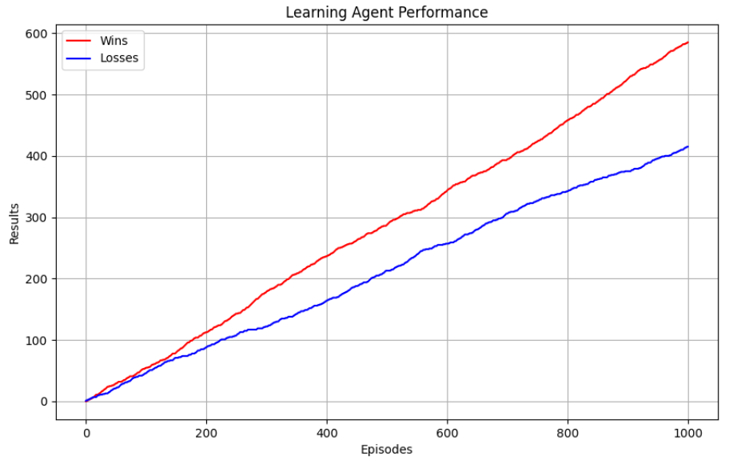

# checkers_game

Reinforcement learning 'American Checkers 6x6' project.

# Main file

## Training the agents

- To train the agents set the boolean 'training' variable to True.

```
training = True
```

- Adjust the amount of training episodes.

```
train(1000)
```

- Run 'main' and wait some time for training.

## Playing agent vs agent

- To simulate playing of agent vs agent set 'training' variable to False and 'playWithGui' to False.

```
training = False
playWithGui = False
```

- Adjust the amount of playing episodes.

```
play_game(1000)
```

- Run 'main' and wait some time for agents to finish playing.

- Resulting graph of agent's performance will be shown. The graph is made for the agent making first move.

## Playing agent vs human

- To play against the agent set 'training' variable to False and 'playWithGui' to True.

```
training = False
playWithGui = True
```

- Run 'main'.

- You will play until you close the window or stop the program from your IDE.

# Reinforcement learning

## Approach

Basic idea was to train the agents using Q-learning approach.
After training the agent we moved forward and added Deep Q-learning to compare the performance of the agents in this simple game. 

About the comparison you can read in more details [here](https://www.baeldung.com/cs/q-learning-vs-deep-q-learning-vs-deep-q-network).

## Results

With a proper setup of the agents and with the same amount of training episodes we see the following graph where DQL agents performs better than his opponent.


